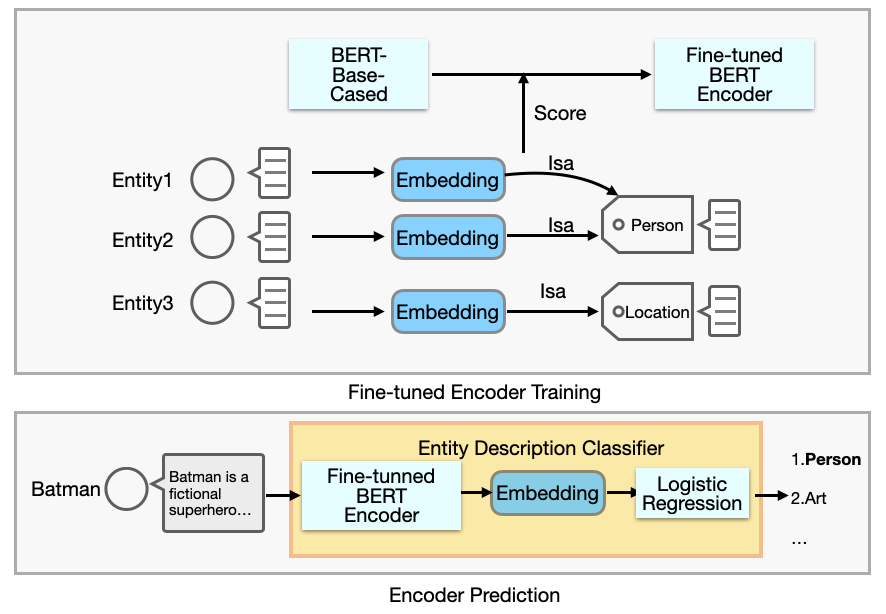

# BLP Based Text Classification

<div>
<a href="https://github.com/migalkin/StarE/blob/master/LICENSE">
    </a>
    <a href="https://doi.org/10.5281/zenodo.4501273"></a>
</div>

<br><br>
<div align="center">

</div>
<br><br>

This repository contains the code used for question and entity description classification. The implementation is based on the paper "Inductive entity representations from text via link prediction". For more deatails please refer the following:

```bibtex
@inproceedings{daza2021inductive,
    title = {Inductive Entity Representations from Text via Link Prediction},
    author = {Daniel Daza and Michael Cochez and Paul Groth},
    booktitle = {Proceedings of The Web Conference 2021},
    year = {2021},
    doi = {10.1145/3442381.3450141},
}
```

In this work, we adopt BLP classfiers to understand the intention of question and summerize the semantic of entities' description. To this end, (1two fine-tuned BERT encoder are trained for each of specific task and (2)we used logistic regression models to fit in the generated embedding for classification.


## Usage

Please follow the instructions to reproduce the experiments output, or to train a classification model with your own data.

### 1. Install the requirements

Creating a new environment (e.g. with `conda`) is recommended. Use `requirements.txt` to install the dependencies:

```sh
conda create -n blp python=3.7
conda activate blp
pip install -r requirements.txt
```

### 2. Download the data

We provide a labeled QA dataset collected from [TrivaQA](https://aclanthology.org/P17-1147/) and [QBLink](https://aclanthology.org/D18-1134/) under the taxonomy of [FIGER](https://www.aaai.org/ocs/index.php/AAAI/AAAI12/paper/view/5152) 8 coarse labels. Please download the processed files and put into folder data 

| Download link                                                | Size (compressed) |
| ------------------------------------------------------------ | ----------------- |
| [Labeled Questions](https://drive.google.com/file/d/1dg5iku9lsYxvezK8swCHGqKMqxRA73nu/view?usp=sharing) | 1.5 MB            |
| [Labeled Entities](https://drive.google.com/file/d/1WW3-snDC1TmyyVkDV5Brt-18vvbhV7KG/view?usp=sharing) | 1 MB            |

<!-- 
Note that the KG-related files above contain both *transductive* and *inductive* splits. Transductive splits are commonly used to evaluate lookup-table methods like ComplEx, while inductive splits contain entities in the test set that are not present in the training set. Files with triples for the inductive case have the `ind` prefix, e.g. `ind-train.txt`.
 -->
### 3. Fine-tuned BERT model training

**Link prediction**
We provide trained fine-tuned BERT encoders, please download and put under the folder models. To generate embedding by provided model please run 
```sh
python embedding.py with dataset='questions'
```
To check that all dependencies are correctly installed, run a quick test on a small graph (this should take less than 1 minute on GPU):

```sh
./scripts/test-umls.sh
```
If you want to train another fine-tuned model, please follow the same data format and run the following command. 
```sh
python train.py with dataset='questions'
```
<!-- The following table is a adapted from our paper. The "Script" column contains the name of the script that reproduces the experiment for the corresponding model and dataset. For example, if you want to reproduce the results of BLP-TransE on FB15k-237, run -->
<!-- 
```sh
./scripts/blp-transe-fb15k237.sh
```

**4. Entity classification**

After generating or training for link prediction, a tensor of embeddings for all entities is computed and saved in a file with name `ent_emb-[ID].pt` where `[ID]` is the id of the experiment in the database (we use [Sacred](https://sacred.readthedocs.io/en/stable/index.html) to manage experiments). Another file called `ents-[ID].pt` contains entity identifiers for every row in the tensor of embeddings.

```sh
python train.py node_classification with dataset=DATASET
```

The embedding will be used to fit a logistic regression classifier. The corresponding lr classifiers are already in the models folder, to perform classification on embedding files, please run 
<!-- To ease reproducibility, we provide these tensors, which are required in the entity classification task. Click on the ID, download the file into the `output` folder, and decompress it. An experiment can be reproduced using the following command: -->

```sh
python train.py node_classification with checkpoint=ID dataset=DATASET
```

where `DATASET` is either `WN18RR` or `FB15k-237`. For example:

```sh
python train.py node_classification with checkpoint=199 dataset=WN18RR
```


<!-- **Information retrieval**

This task runs with a pre-trained model saved from the link prediction task. For example, if the model trained is `blp` with `transe` and it was saved as `model.pt`, then run the following command to run the information retrieval task:

```sh
python retrieval.py with model=blp rel_model=transe \
checkpoint='output/model.pt'
``` -->

<!-- 
## Using your own data

If you have a knowledge graph where entities have textual descriptions, you can train a BLP model for the tasks of inductive link prediction, and entity classification (if you also have labels for entities).

To do this, add a new folder inside the `data` folder (let's call it `my-kg`). Store in it a file containing the triples in your KG. This should be a text file with one tab-separated triple per line (let's call it `all-triples.tsv`).

To generate inductive splits, you can use `data/utils.py`. If you run

```sh
python utils.py drop_entities --file=my-kg/all-triples.tsv
```
