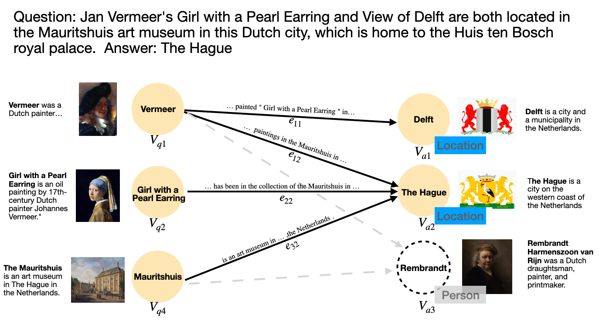

# DELFT-Extend

This repository contains the code for the thesis Enhancing Question Answering with a Free-text Knowledge Graph. This work was aimed to further imrpove the ability of [DELFT](https://arxiv.org/abs/2103.12876). The original repository can be found [here](https://github.com/henryzhao5852/DELFT).
# Overview

We introduce a pruning framework for free-text Knowledge Graph with more focus on candidates relevance to question's intention. To do so:
- Two classifiers are trained to indentify the question's Expected Answer Type(EAT) and summerzie the entity's semantics by label. 
- A pruned free-text KG can be generated by matching labels between questions and entities. 

## 0 Dependency Installation
Run python setup.py develop to install required dependencies for DELFT.

## 1 Data and Trained Model Download

This part is the same as the DELFT repository. For each experimented dataset, we provide processed graph input [here](https://obj.umiacs.umd.edu/delft_release/grounded_graph.zip), after downloading, unzip it and put into data folder (the tokenized version is for glove setting, while the other is for bert setting).
We also provide trained model [here](https://obj.umiacs.umd.edu/delft_release/trained_models.zip), unzip the downloaded model and put into experiments folder. Also, the original datasets are [here](https://obj.umiacs.umd.edu/delft_release/original_questions.zip). 
For newly introduced DELFT-LUKE, we provide a trained model [here](https://drive.google.com/file/d/1PHSP_NJTQaoS2312QFbTDYuZosQJjK_Q/view?usp=sharing).

For delft glove, downloading pre-trained glove embeddings are required, the link is [here](http://downloads.cs.stanford.edu/nlp/data/glove.840B.300d.zip).

## 2 Graph Pruning
The relevant content for graph pruning is palced under the folder BLP, please check the readme for reference.
For the purpose of experiments, we provide pruned free-text KG on TriviaQA and QBLink's test set [here](https://drive.google.com/file/d/1l9rlbQ4sAb6VmRFt7flseKVXG0OIY99e/view?usp=sharing).

## 3 Run Experiments
The experiments include DELFT-Bert, DELFT-Glove and newly introduced DELFT-LUKE, with different embeddings, each experiment has a seperate folder (see readme.md on each folder). 

## Contact
Please send me an email(huishiqiu@gmail.com) or report issue on github if you meet any problem.
